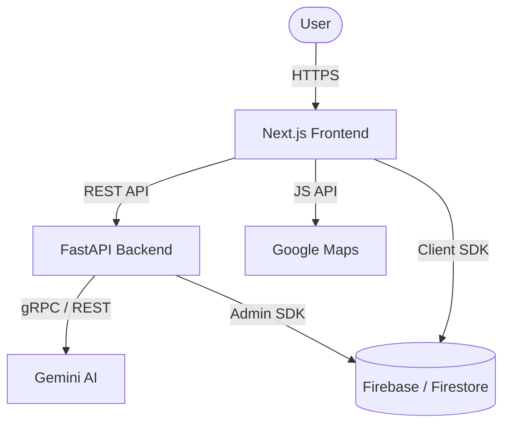

# Stadium Ops AI

An intelligent, real-time command center built for the FIFA World Cup 2026. This platform empowers stadium organizers and field volunteers with dynamic resource allocation, AI-driven scenario simulation, and robust accessibility standards.

---

# Problem Statement

Managing operations for a mega-event like the FIFA World Cup involves coordinating tens of thousands of staff, managing massive crowd flows, and responding to unpredictable incidents (e.g., weather anomalies, gate congestion, or medical emergencies). Traditional systems rely on static playbooks and manual communication channels, which often leads to delayed responses, misallocated resources, and compromised safety.

---

# Solution

Stadium Ops AI transforms stadium management from a reactive process into a proactive, AI-driven operation. By centralizing incident reports, volunteer tracking, and real-time data ingestion, the platform provides a unified view of the stadium. More importantly, it integrates Gemini AI to dynamically simulate crisis scenarios, predict bottlenecks, and automatically suggest optimal resource reallocations, ensuring that operations remain fluid and secure under any circumstances.

---

# Key Features

## AI Features
- **Scenario Simulation**: Simulates crisis situations (e.g., "Heavy Rain", "Gate Breach") using Gemini AI to predict operational impact.
- **Dynamic Reallocation**: Automatically suggests optimal volunteer deployments based on real-time crowd density and incident severity.
- **Rule Engine Validation**: Pre-filters AI suggestions against strict operational constraints to ensure physical viability.

## Organizer Features
- **Real-Time Dashboard**: A centralized, interactive map displaying incident heatmaps, crowd flows, and volunteer locations.
- **Assignment Management**: Dispatch volunteers to high-priority zones with a single click.
- **Data Ingestion**: Upload bulk CSV schedules or incident reports for immediate processing.

## Volunteer Features
- **Field Ops Portal**: A mobile-optimized interface for volunteers to receive tasks and report ground-level incidents.
- **Real-Time Updates**: Status updates and task priorities pushed instantly to the field.

## Analytics
- **Live Metrics**: Tracks active incidents, resolved issues, and volunteer utilization rates.
- **Heatmaps**: Visualizes congestion zones to pre-emptively reroute crowds.

## Security
- **Role-Based Access Control**: Strict segregation between Organizer and Volunteer portals.
- **Secure Configuration**: Firebase Admin SDK integration and production-safe global exception handling to prevent stack trace leaks.

## Accessibility
- **Screen Reader Support**: Critical async updates (Toasts, Map loading) use `aria-live` and `role="status"`.
- **Keyboard Navigation**: Form inputs use semantic HTML and correct focus management.

---

# System Architecture



---

# Technology Stack

| Component | Technology | Description |
| :--- | :--- | :--- |
| **Frontend** | Next.js 16.2, React 19.2, TailwindCSS v4 | App router, Server/Client components, responsive UI |
| **Backend** | FastAPI, Python 3.11+ | High-performance async API with Pydantic validation |
| **AI** | Google Gemini API | Real-time generative scenario simulation and planning |
| **Authentication** | Firebase Auth | Secure, token-based authentication |
| **Database** | Firebase Firestore | NoSQL real-time cloud database |
| **Maps** | Google Maps JS API | Dynamic rendering of stadium zones and incidents |
| **Testing** | Pytest, Vitest | Backend unit/integration tests and frontend smoke tests |
| **Code Quality** | Ruff, TypeScript | Strict linting, type-safety, and formatting enforcement |
| **Deployment** | Vercel, Render | Automated CI/CD pipelines (placeholder) |

---

# Folder Structure

```text
stadium-ops-ai/
├── backend/
│   ├── app/
│   │   ├── config/       # Environment & AI configs
│   │   ├── core/         # Security & Firebase init
│   │   ├── models/       # Pydantic schemas
│   │   ├── routers/      # FastAPI endpoints
│   │   ├── schemas/      # API Request/Response schemas
│   │   ├── services/     # Business logic & Gemini integration
│   │   ├── tests/        # Pytest suite
│   │   ├── utils/        # Helper functions
│   │   └── main.py       # FastAPI application entry point
│   ├── scripts/          # Demo data generation
│   ├── conftest.py       # Pytest configuration
│   └── pyproject.toml    # Python dependencies & Ruff config
├── frontend/
│   ├── src/
│   │   ├── app/          # Next.js App Router pages
│   │   ├── components/   # React UI & Map components
│   │   ├── lib/          # Firebase client config
│   │   ├── mock/         # Local test data
│   │   ├── types/        # TypeScript interfaces
│   │   └── middleware.ts # Next.js routing middleware
│   ├── vitest.config.ts  # Frontend test configuration
│   └── package.json      # Node dependencies
├── docs/                 # Hack2Skill architecture documentation
├── .github/              # CI/CD Workflows
└── README.md
```

---

# Installation

### Environment Variables
Before starting, create `.env` files in both the `backend/` and `frontend/` directories based on their respective `.env.example` templates. Replace all placeholders with your actual API keys.

### Backend Setup
```bash
cd backend
python -m venv venv
source venv/Scripts/activate  # On Windows: .\venv\Scripts\activate
pip install -r requirements.txt
pip install -r requirements-dev.txt
```

### Frontend Setup
```bash
cd frontend
npm install
```

### Running Locally
**Terminal 1 (Backend):**
```bash
cd backend
source venv/Scripts/activate
uvicorn app.main:app --reload --port 8000
```
**Terminal 2 (Frontend):**
```bash
cd frontend
npm run dev
```

---

# Testing

Execute the following commands to run tests, calculate coverage, and enforce code quality:

**Backend:**
```bash
cd backend
pytest
pytest --cov=app
ruff check .
```

**Frontend:**
```bash
cd frontend
npm run test
npm run test -- --coverage
npm run type-check
npm run build
```

---

# Security

- **RBAC**: Implemented strict Role-Based Access Control. `require_organizer` and `require_volunteer` dependencies protect backend routes.
- **Environment Management**: Hardcoded credentials have been entirely purged. Demo passwords and Firebase secrets are injected dynamically via environment variables.
- **Error Handling**: A custom production exception handler safely intercepts HTTP 500 errors, logging stack traces internally while returning a sanitized response to clients.

---

# Accessibility

- **Dynamic Announcements**: Introduced `aria-live="polite"` and `role="status"` to all dynamic loading states (e.g., `MapLoader.tsx`) and notification systems (`Toast.tsx`).
- **Semantic HTML**: Restructured form controls to utilize proper `<label htmlFor="id">` attributes, vastly improving screen reader navigation.

---

# Performance

- **Non-blocking I/O**: Migrated all synchronous Google Gemini API integrations (`run_ai_pipeline`, `run_scenario_pipeline`) into thread pools utilizing `asyncio.to_thread`. This prevents the Uvicorn event loop from stalling during prolonged LLM inference, ensuring the real-time API remains highly responsive.
- **Next.js Optimization**: Leveraged Server Components where appropriate to minimize client-side bundle size, while Client Components strictly manage interactive states.

---

# Screenshots

*(Placeholder: Architecture Diagram)*
*(Placeholder: Organizer Dashboard)*
*(Placeholder: Scenario Simulation View)*

---

# Future Improvements

- **End-to-End Testing**: Implementation of Cypress or Playwright for complete browser-based workflow validation.
- **Automated Accessibility CI**: Integration of `axe-core` within the CI pipeline to prevent future WCAG regressions.
- **Offline Mode**: Progressive Web App (PWA) capabilities for the Volunteer Field Ops portal in case of stadium network congestion.

---

# Team

- **Developer**: Stadium Ops Hacker

---

# License

MIT License.
