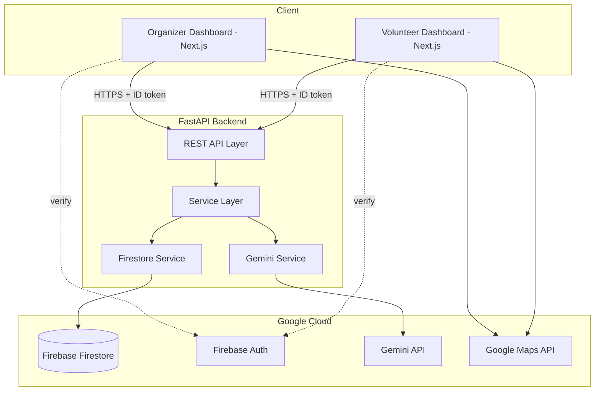

# Stadium Operations Dashboard

## Project Overview

A GenAI-powered operations dashboard designed for FIFA World Cup 2026 stadiums. This application ingests real-time operational signals (crowd density, volunteer availability, medical incidents) and uses Google Gemini to provide structured, reasoned recommendations for stadium organizers and clear, plain-language instructions for volunteers.

## Features

- **Role-based Authentication:** Secure Firebase login separating Organizers and Volunteers.
- **Intelligent Crowd Analysis:** Upload CSV crowd data to receive Gemini AI-powered congestion risk levels and gate recommendations.
- **Scenario Simulator:** Context-aware incident response simulation mapping scenarios (e.g. Heavy Rain + Gate Closure) to timeline-based action plans.
- **Resource Optimization:** AI assigns specific volunteers to tasks based on skills, proximity, and workload, generating optimized assignment rosters.
- **Self-Healing Fallback:** Automatic pivoting to a deterministic Rule Engine if the AI encounters downtime or returns unparseable outputs.
- **Modular Frontend:** Built with Next.js App Router and TailwindCSS.

## Architecture

- **Frontend**: Next.js (App Router), TypeScript, TailwindCSS (deployed as a PWA)
- **Backend**: FastAPI (Python) for API endpoints and Gemini AI interactions
- **Database/Auth**: Firebase Firestore + Firebase Auth
- **AI**: Google Gemini API (structured JSON output)
- **Maps**: Google Maps JS API



## Folder Structure

```
.
├── .github/                 # GitHub configurations
│   └── workflows/
│       └── ci.yml           # GitHub Actions CI workflow
├── frontend/                # Next.js frontend application
│   ├── src/                 # Application source code
│   │   ├── app/             # App router pages (organizer, volunteer)
│   │   ├── components/      # Reusable React components
│   │   └── lib/             # Utility functions, Firebase setup
│   ├── public/              # Static assets
│   ├── .env.example         # Frontend environment variables template
│   ├── eslint.config.mjs    # ESLint configuration
│   └── .prettierrc          # Prettier configuration
├── backend/                 # FastAPI backend application
│   ├── app/
│   │   ├── config/          # Configurations & Settings
│   │   ├── core/            # Core configurations (Auth, etc.)
│   │   ├── models/          # Pydantic models for validation & prompt context
│   │   ├── routers/         # API endpoints
│   │   ├── schemas/         # Shared schemas (API request/response)
│   │   ├── services/        # Business logic (Gemini, Firestore)
│   │   ├── tests/           # Unit and integration tests
│   │   ├── utils/           # Utility helpers
│   │   └── main.py          # FastAPI application entry point
│   ├── scripts/             # Utility scripts (e.g., seeding demo data)
│   ├── requirements.txt     # Python runtime dependencies
│   ├── requirements-dev.txt # Python development tools
│   ├── pyproject.toml       # Black & Ruff configurations
│   └── .env.example         # Backend environment variables template
└── docs/                    # Product and technical documentation
```

## Setup Instructions

## Quick Start

### Prerequisites
- Node.js (v18+)
- Python (3.11+)
- **WSL or Docker (Required for Windows):** Due to Windows Defender Application Control policies, the `grpcio` library (required by Firebase Admin) is blocked natively on Windows. You **must** run the backend in WSL or Docker to test the AI integration properly.
- Firebase Account (with Firestore and Authentication enabled)
- Google Cloud Account (for Gemini and Google Maps API keys)

2. Copy `.env.example` to `.env`:
   ```bash
   cp .env.example .env
   ```
3. Fill in the values for `GEMINI_API_KEY`, `GOOGLE_MAPS_API_KEY`, and `FIREBASE_CREDENTIALS_PATH`.

#### Frontend
1. Navigate to the `frontend/` directory.
2. Copy `.env.example` to `.env.local`:
   ```bash
   cp .env.example .env.local
   ```
3. Fill in your Firebase configuration and Google Maps API key.

### 2. Backend Setup
```bash
cd backend
python -m venv venv
source venv/bin/activate  # On Windows: venv\Scripts\activate
pip install -r requirements.txt
pip install -r requirements-dev.txt
uvicorn app.main:app --reload
```

### 3. Frontend Setup
```bash
cd frontend
npm install
npm run dev
```

## Development Workflow

### Python Code Quality (Backend)
Format and lint checking is done using `black` and `ruff`.
- Format code: `black backend/`
- Lint code: `ruff check backend/ --fix`

### Node Code Quality (Frontend)
Format and lint checking is done using `Prettier` and `ESLint`.
- Format code: `npm run format`
- Lint code: `npm run lint`
- Type checking: `npm run type-check`

### Commit Conventions
This project follows Conventional Commits:
- `feat`: A new feature
- `fix`: A bug fix
- `docs`: Documentation changes
- `style`: Code style changes (formatting, etc.)
- `refactor`: Code changes that neither fix a bug nor add a feature
- `test`: Adding missing tests or correcting existing tests
- `chore`: Infrastructure, configuration, or library updates (e.g. `chore: improve project foundation`)

## Project Roadmap

- [x] **Phase 0**: Project Setup
- [x] **Phase 0.5**: Foundation Improvements (Code quality configs, GHA CI, structure)
- [ ] **Phase 1**: Auth & Roles
- [ ] **Phase 2**: Data Ingestion
- [ ] **Phase 3**: Gemini Analysis Pipeline
- [ ] **Phase 4**: Incidents
- [ ] **Phase 5**: Volunteer Tasks
- [ ] **Phase 6**: Map Integration
- [ ] **Phase 7**: Polish, Edge Cases, Testing
- [ ] **Phase 8**: Deployment & Demo Prep
