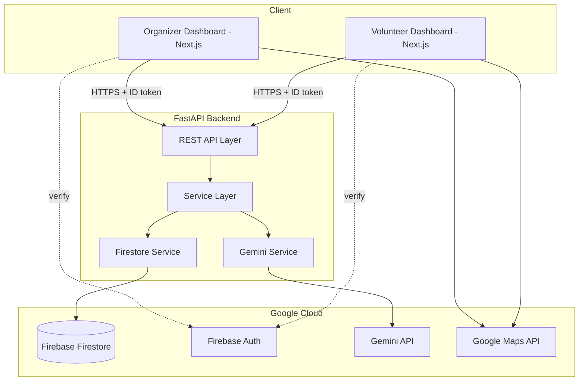

# Stadium Operations Dashboard

## Project Overview

A GenAI-powered operations dashboard designed for FIFA World Cup 2026 stadiums. This application ingests real-time operational signals (crowd density, volunteer availability, medical incidents) and uses Google Gemini to provide structured, reasoned recommendations for stadium organizers and clear, plain-language instructions for volunteers.

## Features

- **Role-based Authentication:** Secure Firebase login separating Organizers and Volunteers.
- **Intelligent Crowd Analysis:** Upload CSV crowd data to receive Gemini AI-powered congestion risk levels and gate recommendations.
- **Scenario Simulator:** Context-aware incident response simulation mapping scenarios (e.g. Heavy Rain + Gate Closure) to timeline-based action plans.
- **Resource Optimization:** AI assigns specific volunteers to tasks based on skills, proximity, and workload, generating optimized assignment rosters.
- **Map Visualization:** An interactive Google Maps Decision Center overlaying live stadium gates, incidents, and volunteer locations with real-time AI metrics.
- **Self-Healing Fallback:** Automatic pivoting to a deterministic Rule Engine if the AI encounters downtime or returns unparseable outputs.
- **Modular Frontend:** Built with Next.js App Router and TailwindCSS.

## Architecture

- **Frontend**: Next.js (App Router), TypeScript, TailwindCSS (deployed as a PWA)
- **Backend**: FastAPI (Python) for API endpoints and Gemini AI interactions
- **Database/Auth**: Firebase Firestore + Firebase Auth
- **AI**: Google Gemini API (structured JSON output)
- **Maps**: Google Maps JS API



## Folder Structure

```
.
├── .github/                 # GitHub configurations
│   └── workflows/
│       └── ci.yml           # GitHub Actions CI workflow
├── frontend/                # Next.js frontend application
│   ├── src/                 # Application source code
│   │   ├── app/             # App router pages (organizer, volunteer)
│   │   ├── components/      # Reusable React components
│   │   └── lib/             # Utility functions, Firebase setup
│   ├── public/              # Static assets
│   ├── .env.example         # Frontend environment variables template
│   ├── eslint.config.mjs    # ESLint configuration
│   └── .prettierrc          # Prettier configuration
├── backend/                 # FastAPI backend application
│   ├── app/
│   │   ├── config/          # Configurations & Settings
│   │   ├── core/            # Core configurations (Auth, etc.)
│   │   ├── models/          # Pydantic models for validation & prompt context
│   │   ├── routers/         # API endpoints
│   │   ├── schemas/         # Shared schemas (API request/response)
│   │   ├── services/        # Business logic (Gemini, Firestore)
│   │   ├── tests/           # Unit and integration tests
│   │   ├── utils/           # Utility helpers
│   │   └── main.py          # FastAPI application entry point
│   ├── scripts/             # Utility scripts (e.g., seeding demo data)
│   ├── requirements.txt     # Python runtime dependencies
│   ├── requirements-dev.txt # Python development tools
│   ├── pyproject.toml       # Black & Ruff configurations
│   └── .env.example         # Backend environment variables template
└── docs/                    # Product and technical documentation
```

## Setup Instructions

## Quick Start

### Prerequisites
- Node.js (v18+)
- Python (3.11+)
- **WSL or Docker (Required for Windows):** Due to Windows Defender Application Control policies, the `grpcio` library (required by Firebase Admin) is blocked natively on Windows. You **must** run the backend in WSL or Docker to test the AI integration properly.
- Firebase Account (with Firestore and Authentication enabled)
- Google Cloud Account (for Gemini and Google Maps API keys)

2. Copy `.env.example` to `.env`:
   ```bash
   cp .env.example .env
   ```
3. Fill in the values for `GEMINI_API_KEY`, `GOOGLE_MAPS_API_KEY`, and `FIREBASE_CREDENTIALS_PATH`.

#### Frontend
1. Navigate to the `frontend/` directory.
2. Copy `.env.example` to `.env.local`:
   ```bash
   cp .env.example .env.local
   ```
3. Fill in your Firebase configuration and Google Maps API key.

### 2. Backend Setup
```bash
cd backend
python -m venv venv
source venv/bin/activate  # On Windows: venv\Scripts\activate
pip install -r requirements.txt
pip install -r requirements-dev.txt
uvicorn app.main:app --reload
```

### 3. Frontend Setup
```bash
cd frontend
npm install
npm run dev
```

## Development Workflow

### Python Code Quality (Backend)
Format and lint checking is done using `black` and `ruff`.
- Format code: `black backend/`
- Lint code: `ruff check backend/ --fix`

### Node Code Quality (Frontend)
Format and lint checking is done using `Prettier` and `ESLint`.
- Format code: `npm run format`
- Lint code: `npm run lint`
- Type checking: `npm run type-check`

### Commit Conventions
This project follows Conventional Commits:
- `feat`: A new feature
- `fix`: A bug fix
- `docs`: Documentation changes
- `style`: Code style changes (formatting, etc.)
- `refactor`: Code changes that neither fix a bug nor add a feature
- `test`: Adding missing tests or correcting existing tests
- `chore`: Infrastructure, configuration, or library updates (e.g. `chore: improve project foundation`)

## Project Roadmap

- [x] **Phase 0**: Project Setup
- [x] **Phase 0.5**: Foundation Improvements (Code quality configs, GHA CI, structure)
- [x] **Phase 1**: Auth & Roles
- [x] **Phase 2**: Data Ingestion
- [x] **Phase 3**: Gemini Analysis Pipeline
- [x] **Phase 4**: Incidents
- [x] **Phase 5**: Volunteer Tasks
- [x] **Phase 6**: Map Integration
- [x] **Phase 7**: Polish, Edge Cases, Testing

## 🚀 Demo Guide (For Judges)

  1. **Login**: Navigate to `/login`. Use the one-click auto-fill buttons at the bottom of the page to login as either Organizer or Volunteer.
2. **Dashboard (Upload)**: Once logged in as Organizer, download `docs/sample_crowd_data.csv` and upload it via the dashboard. You will see Gemini AI analyze the data and return congestion alerts and risk levels with a confidence score.
3. **Map**: Click on the Map icon in the sidebar to see the Operations Control Center. Observe the AI Activity Feed and the Decision Center deriving insights from the active incidents.
4. **Scenarios**: Go to the Scenario Simulator, select "Heavy Rain" and "Gate Closure", and run the simulation to see the AI generate an operational plan.
5. **Volunteer View**: Open an incognito window, click the Volunteer auto-fill on the login page, and observe the specific tasks assigned to that role without access to the Organizer sidebar.

## Deployment Guide (Production)

### 1. Backend Deployment (Render or Railway)
The FastAPI backend requires Python 3.11+. We recommend Render or Railway.
1. Create a new Web Service and link your GitHub repository.
2. Set the root directory to `backend`.
3. Set the build command: `pip install -r requirements.txt`
4. Set the start command: `uvicorn app.main:app --host 0.0.0.0 --port $PORT`
5. **Environment Variables**:
   - `GEMINI_API_KEY`: Your Google Gemini API Key.
   - `GOOGLE_MAPS_API_KEY`: Your Google Maps API Key.
   - `FIREBASE_SERVICE_ACCOUNT_PATH`: Alternatively, you can inject the Firebase JSON as an environment variable (`FIREBASE_SERVICE_ACCOUNT_JSON`) if your hosting provider supports it, and adjust `firebase_admin.credentials.Certificate()` in `app/core/firebase.py` to parse it from `os.getenv()`.
   - `ALLOWED_ORIGINS`: Set this to your frontend URL (e.g., `https://your-frontend.vercel.app`).

### 2. Frontend Deployment (Vercel)
The Next.js frontend is heavily optimized for Vercel.
1. Create a new Project on Vercel and import your repository.
2. Set the Root Directory to `frontend`.
3. The framework preset should automatically detect `Next.js`.
4. **Environment Variables**:
   - `NEXT_PUBLIC_API_URL`: Set this to your deployed backend URL (e.g., `https://your-backend.onrender.com/api/v1`).
   - `NEXT_PUBLIC_FIREBASE_API_KEY`, `NEXT_PUBLIC_FIREBASE_AUTH_DOMAIN`, etc.: Copy these exactly from your Firebase Console.
   - `NEXT_PUBLIC_GOOGLE_MAPS_API_KEY`: Your Google Maps API Key (ensure domains are whitelisted in GCP).
5. Deploy. The Next.js App Router will handle all API proxying and static generation.
