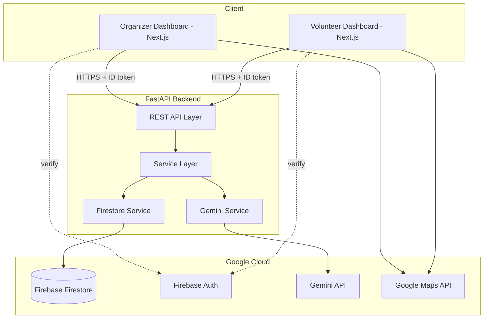

# Stadium Operations Dashboard (Hack2Skill PromptWars Virtual)


## Problem Statement

Managing operations for a mega-event like the FIFA World Cup 2026 involves coordinating tens of thousands of fans, hundreds of volunteers, and responding instantly to dynamic incidents. Traditional stadium command centers rely heavily on manual observation and deterministic rule engines, leading to bottlenecks, inefficient volunteer deployment, and slow incident response times during critical scenarios like sudden weather changes or medical emergencies.

## Solution Overview

A **GenAI-powered operations dashboard** designed specifically for FIFA World Cup 2026 stadiums. This application ingests real-time operational signals (crowd density, volunteer availability, medical incidents) and uses Google Gemini to provide structured, reasoned recommendations for stadium organizers and clear, plain-language instructions for volunteers. It bridges the gap between raw data and actionable intelligence, ensuring a safe and seamless experience for fans.

## AI Workflow

1. **Ingestion:** Raw operational data (e.g., crowd telemetry CSVs, incident reports) is submitted to the backend.
2. **Contextualization:** The FastAPI backend constructs rich prompts combining the raw data with stadium layout context and current event states.
3. **Reasoning (Gemini):** Google Gemini 2.0 Flash processes the context, applying safety protocols and operational logic to generate structured JSON outputs (risk levels, volunteer assignments, step-by-step action plans).
4. **Self-Healing Fallback:** If the AI encounters downtime or returns unparseable outputs, the system automatically pivots to a deterministic Rule Engine, ensuring 100% uptime for critical stadium operations.

## Architecture

- **Frontend**: Next.js (App Router), TypeScript, TailwindCSS (deployed as a PWA)
- **Backend**: FastAPI (Python) for API endpoints and Gemini AI interactions
- **Database/Auth**: Firebase Firestore + Firebase Auth
- **AI**: Google Gemini API (structured JSON output)
- **Maps**: Google Maps JS API



## Tech Stack

- **Frontend:** React 19, Next.js 16, TailwindCSS v4, TypeScript
- **Backend:** Python 3.11+, FastAPI, Pydantic, slowapi (Rate Limiting)
- **AI / Cloud:** Google Gemini API, Firebase Admin SDK (Firestore, Auth), Google Maps JS API
- **Testing & Tooling:** Pytest, Ruff, ESLint, Prettier

## Features

- **Role-based Authentication:** Secure Firebase login separating Organizers and Volunteers.
- **Intelligent Crowd Analysis:** Upload CSV crowd data to receive Gemini AI-powered congestion risk levels and gate recommendations.
- **Scenario Simulator:** Context-aware incident response simulation mapping scenarios (e.g. Heavy Rain + Gate Closure) to timeline-based action plans.
- **Resource Optimization:** AI assigns specific volunteers to tasks based on skills, proximity, and workload, generating optimized assignment rosters.
- **Map Visualization:** An interactive Google Maps Decision Center overlaying live stadium gates, incidents, and volunteer locations with real-time AI metrics.

## Folder Structure

```text
.
├── .github/workflows/       # GitHub Actions CI workflow
├── frontend/                # Next.js frontend application
│   ├── src/                 
│   │   ├── app/             # App router pages (organizer, volunteer)
│   │   ├── components/      # Reusable React components
│   │   └── lib/             # Utility functions, Firebase setup
│   └── .env.example         # Frontend environment variables template
├── backend/                 # FastAPI backend application
│   ├── app/
│   │   ├── config/          # Configurations & Settings
│   │   ├── core/            # Core configurations (Auth, etc.)
│   │   ├── models/          # Pydantic models & Enums
│   │   ├── routers/         # API endpoints
│   │   ├── services/        # Business logic (Gemini, Firestore)
│   │   └── tests/           # Pytest unit and integration tests
│   └── requirements.txt     # Python runtime dependencies
└── docs/                    # Product and technical documentation
```

## Screenshots


## Installation

### Prerequisites
- Node.js (v18+)
- Python (3.11+)
- **WSL or Docker (Required for Windows):** The `grpcio` library (required by Firebase Admin) is blocked natively on Windows Defender Application Control policies.
- Firebase Account (Firestore and Authentication enabled)
- Google Cloud Account (Gemini and Google Maps API keys)

### 1. Backend Setup
```bash
cd backend
python -m venv venv
source venv/bin/activate  # On Windows: venv\Scripts\activate
pip install -r requirements.txt
pip install -r requirements-dev.txt
uvicorn app.main:app --reload
```

### 2. Frontend Setup
```bash
cd frontend
npm install
npm run dev
```

## Environment Variables

**Backend (`backend/.env`):**
```ini
GEMINI_API_KEY=your_gemini_api_key
GOOGLE_MAPS_API_KEY=your_google_maps_api_key
FIREBASE_CREDENTIALS_PATH=./path-to-firebase-adminsdk.json
ALLOWED_ORIGINS=http://localhost:3000
```

**Frontend (`frontend/.env.local`):**
```ini
NEXT_PUBLIC_API_URL=http://localhost:8000/api/v1
NEXT_PUBLIC_FIREBASE_API_KEY=your_firebase_api_key
NEXT_PUBLIC_FIREBASE_AUTH_DOMAIN=your_project.firebaseapp.com
NEXT_PUBLIC_FIREBASE_PROJECT_ID=your_project_id
NEXT_PUBLIC_GOOGLE_MAPS_API_KEY=your_google_maps_api_key
```

## Demo Video

[Watch the full demo here](#) *(Link to YouTube/Vimeo)*

## Team Members

- **Team Member 1** - Full Stack Developer
- **Team Member 2** - AI Engineer
- *(Add team members here)*

## Future Improvements

- **Push Notifications:** Integrating Firebase Cloud Messaging (FCM) to send instant alerts to volunteers' mobile devices.
- **Predictive ML Models:** Adding a traditional forecasting model alongside Gemini to predict crowd density 30 minutes into the future based on historical ticketing data.
- **Offline Mode:** Enhancing the volunteer PWA with full offline capabilities using IndexedDB to ensure connectivity in deep concrete areas of the stadium.

## Limitations

- **Latency:** Gemini API calls introduce a 2-4 second latency for complex reasoning tasks. Deterministic fallbacks are used for ultra-low latency requirements.
- **Cost:** High throughput of telemetry data being sent to LLMs can become expensive; the current architecture relies on batching to mitigate token usage.
