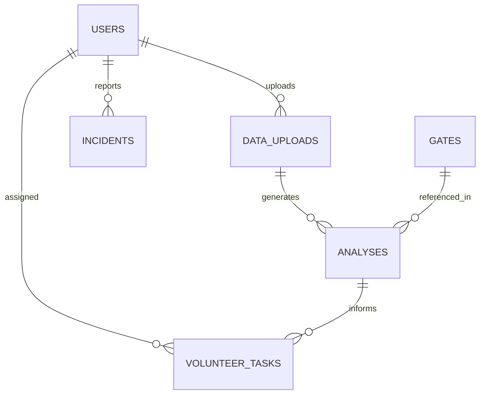

# Database Design (Firebase Firestore)

## Stadium Operations Dashboard

Firestore is a document database — "collections" below are the NoSQL equivalent of tables, and relationships are modeled via reference IDs rather than foreign keys/joins.

---

## 1. Collections Overview

| Collection | Purpose |
|---|---|
| `users` | Organizer and volunteer accounts, role, profile |
| `dataUploads` | Raw CSV/manual data submissions from organizers |
| `analyses` | Gemini-generated recommendations from a given data upload |
| `incidents` | Reported incidents (organizer or volunteer origin) + AI summary/risk |
| `volunteerTasks` | Individual task assignments for volunteers |
| `gates` | Static-ish gate reference data + latest status |

---

## 2. Schema Detail

### `users/{userId}`
| Field | Type | Notes |
|---|---|---|
| `uid` | string | Firebase Auth UID |
| `name` | string | |
| `role` | string | `organizer` \| `volunteer` |
| `email` | string | |
| `phone` | string | optional |
| `createdAt` | timestamp | |

### `dataUploads/{uploadId}`
| Field | Type | Notes |
|---|---|---|
| `uploadedBy` | string | ref → `users/{userId}` |
| `type` | string | `crowd` \| `gate` \| `volunteer` \| `medical` \| `parking` |
| `source` | string | `csv` \| `manual` |
| `rawData` | array/map | parsed rows |
| `createdAt` | timestamp | |

### `analyses/{analysisId}`
| Field | Type | Notes |
|---|---|---|
| `uploadId` | string | ref → `dataUploads/{uploadId}` |
| `congestionAlerts` | array<map> | `{gateId, severity, reasoning}` |
| `predictedBottlenecks` | array<map> | `{location, etaMinutes, confidence, reasoning}` |
| `volunteerSuggestions` | array<map> | `{volunteerId, suggestedLocation, reasoning}` |
| `gateRecommendations` | array<map> | `{fromGateId, toGateId, reasoning}` |
| `riskLevel` | string | `low` \| `medium` \| `high` \| `critical` |
| `rawGeminiResponse` | map | stored for audit/debugging |
| `createdAt` | timestamp | |

### `incidents/{incidentId}`
| Field | Type | Notes |
|---|---|---|
| `reportedBy` | string | ref → `users/{userId}` |
| `location` | geopoint/string | |
| `description` | string | raw text from reporter |
| `aiSummary` | string | Gemini-generated summary |
| `riskLevel` | string | `low` \| `medium` \| `high` \| `critical` |
| `status` | string | `open` \| `in_progress` \| `resolved` |
| `createdAt` | timestamp | |
| `updatedAt` | timestamp | |

### `volunteerTasks/{taskId}`
| Field | Type | Notes |
|---|---|---|
| `volunteerId` | string | ref → `users/{userId}` |
| `analysisId` | string | ref → `analyses/{analysisId}`, optional |
| `title` | string | e.g. "Redirect crowd to Gate C" |
| `priority` | string | `low` \| `medium` \| `high` \| `urgent` |
| `location` | string | |
| `aiInstructions` | string | plain-language Gemini instructions |
| `status` | string | `assigned` \| `acknowledged` \| `completed` |
| `createdAt` | timestamp | |

### `gates/{gateId}`
| Field | Type | Notes |
|---|---|---|
| `name` | string | e.g. "Gate A" |
| `capacity` | number | |
| `currentCrowdCount` | number | last known |
| `status` | string | `open` \| `closed` \| `congested` |
| `location` | geopoint | for map rendering |
| `lastUpdated` | timestamp | |

---

## 3. Relationships



Firestore has no enforced foreign keys — relationships above are maintained at the application layer (backend writes the correct reference IDs; security rules validate the requester owns/matches the reference where relevant).

---

## 4. Indexes

| Collection | Composite Index | Why |
|---|---|---|
| `volunteerTasks` | `volunteerId` + `status` + `createdAt` (desc) | Volunteer dashboard: "my active tasks, newest first" |
| `incidents` | `status` + `riskLevel` + `createdAt` (desc) | Organizer incident triage view |
| `analyses` | `uploadId` + `createdAt` (desc) | Latest analysis per upload |
| `dataUploads` | `uploadedBy` + `createdAt` (desc) | Organizer's upload history |

Single-field indexes are auto-created by Firestore; only the composite ones above need explicit definition in `firestore.indexes.json`.

---

## 5. Sample Records

```json
// analyses/an_001
{
  "uploadId": "up_045",
  "congestionAlerts": [
    { "gateId": "gate_A", "severity": "high", "reasoning": "Entry rate exceeds exit rate by 3x over last 10 min" }
  ],
  "riskLevel": "high",
  "createdAt": "2026-06-11T18:32:00Z"
}

// volunteerTasks/task_017
{
  "volunteerId": "user_082",
  "analysisId": "an_001",
  "title": "Direct incoming crowd to Gate C",
  "priority": "urgent",
  "location": "Gate A exterior concourse",
  "aiInstructions": "Gate A is over capacity. Stand near the north barrier and redirect arriving fans to Gate C, which has 40% spare capacity.",
  "status": "assigned",
  "createdAt": "2026-06-11T18:33:00Z"
}
```

---

## 6. Security Rules (summary)

- Users can read/write only documents where `request.auth.uid` matches an owned reference (own tasks, own uploads).
- Organizers can read all `analyses`, `incidents`, `volunteerTasks`; volunteers can read only their own `volunteerTasks` and submit to `incidents`.
- All writes to `analyses` happen server-side only (via the backend's Firebase Admin credentials) — clients never write directly to `analyses`.
