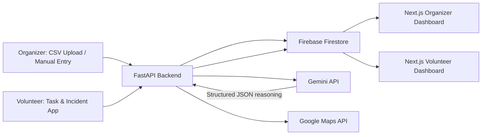

# Stadium Operations Dashboard — AI-Powered Smart Stadium Assistant

**Google PromptWars Virtual Hackathon — Challenge 4: Smart Stadiums & Tournament Operations**
Built for FIFA World Cup 2026 stadium operations teams.

---

## 1. Overview

Stadium Operations Dashboard is a Generative AI–powered web application (PWA) that helps **stadium organizers** make real-time operational decisions and gives **volunteers** clear, AI-guided instructions during large events like FIFA World Cup 2026 matches.

Organizers feed in live operational data (crowd counts, gate status, volunteer availability, medical incidents, parking status) via CSV upload or manual entry. Gemini AI continuously analyzes this data and returns **reasoned recommendations** — not just dashboards of raw numbers — covering congestion risk, bottleneck prediction, volunteer assignment, and incident response.

This is deliberately scoped as a **single-problem-solved-well MVP**: real-time, AI-reasoned operational decision support for two personas, not a general-purpose stadium management suite.

---

## 2. Problem We Solve

During large tournaments, stadium control rooms are flooded with fragmented signals (gate cameras, radios, spreadsheets) and organizers must make fast decisions — which gate to open, where to send volunteers, how urgent an incident is — often too slowly and without structured reasoning. We give organizers a single AI-reasoned operational view, and give volunteers unambiguous, prioritized instructions on their phones.

---

## 3. Key Features

| Feature | Persona | Description |
|---|---|---|
| Data ingestion (CSV / manual) | Organizer | Upload crowd, gate, volunteer, incident, parking data |
| AI congestion & bottleneck analysis | Organizer | Gemini flags current and *predicted* congestion with reasoning |
| AI gate recommendations | Organizer | Suggests alternate gates to redistribute crowd flow |
| AI volunteer assignment suggestions | Organizer | Matches available volunteers to emerging hotspots |
| Incident summarization & risk scoring | Organizer | Gemini summarizes raw incident text and assigns risk level |
| Volunteer task dashboard | Volunteer | Shows assigned task, priority, location, AI instructions |
| Volunteer incident reporting | Volunteer | Quick structured report feeding back into AI analysis loop |
| Live map view | Both | Google Maps overlay of gates, incidents, volunteer positions |

---

## 4. Architecture (High Level)



Full breakdown (frontend/backend layers, AI pipeline, auth flow) is in `SYSTEM_DESIGN.md`.

---

## 5. Tech Stack

| Layer | Choice | Why |
|---|---|---|
| Frontend | Next.js + React + TypeScript + TailwindCSS | Fast to build, PWA-ready, strong Vercel deployment story |
| Backend | FastAPI (Python) | Async, clean typing, easy Gemini SDK integration |
| Database | **Firebase Firestore** (recommended over Supabase) | Native real-time listeners power live volunteer/organizer updates without polling; deepens Google-service integration, which judges explicitly score; simpler auth+db pairing for a 10–14 day build |
| Auth | Firebase Auth | Role-based access (organizer vs volunteer), same ecosystem as Firestore |
| AI | Gemini API | Core reasoning engine for all recommendations |
| Maps | Google Maps API | Gate/incident/volunteer visualization |
| Deployment | Vercel (frontend) + Cloud Run (FastAPI backend) | Fast deploys, generous free tiers, good for demo day |

Rationale and trade-offs discussed further in `SYSTEM_DESIGN.md`.

---

## 6. Setup

### Prerequisites
- Node.js 20+
- Python 3.11+
- Firebase project (Firestore + Auth enabled)
- Gemini API key
- Google Maps API key

### Frontend
```bash
cd frontend
npm install
cp .env.example .env.local   # add Firebase config, Maps API key
npm run dev
```

### Backend
```bash
cd backend
python -m venv venv && source venv/bin/activate
pip install -r requirements.txt
cp .env.example .env         # add GEMINI_API_KEY, Firebase service account
uvicorn app.main:app --reload
```

### Environment Variables (summary)
| Variable | Where | Purpose |
|---|---|---|
| `GEMINI_API_KEY` | backend `.env` | Gemini API access |
| `FIREBASE_SERVICE_ACCOUNT_JSON` | backend `.env` | Server-side Firestore/Auth access |
| `NEXT_PUBLIC_FIREBASE_CONFIG` | frontend `.env.local` | Client Firebase init |
| `NEXT_PUBLIC_MAPS_API_KEY` | frontend `.env.local` | Google Maps rendering |

---

## 7. Folder Structure

```
stadium-ops-dashboard/
├── frontend/
│   ├── app/
│   │   ├── organizer/          # Organizer dashboard routes
│   │   ├── volunteer/          # Volunteer dashboard routes
│   │   └── auth/
│   ├── components/
│   ├── lib/                    # Firebase client, API client
│   └── public/
├── backend/
│   ├── app/
│   │   ├── main.py
│   │   ├── routers/            # data, ai, incidents, volunteers
│   │   ├── services/           # gemini_service.py, firestore_service.py
│   │   ├── models/             # pydantic schemas
│   │   └── core/               # config, auth deps
│   └── requirements.txt
└── docs/                       # this documentation set
```

---

## 8. Documentation Set

| Doc | Purpose |
|---|---|
| `PRD.md` | Product requirements, personas, user stories, MVP scope |
| `SYSTEM_DESIGN.md` | Full architecture, AI flow, deployment |
| `DATABASE.md` | Firestore schema, sample records |
| `API.md` | REST endpoint reference |
| `AI.md` | Gemini prompt design, JSON contracts, safety |
| `UI_UX.md` | Pages, layouts, wireframes |
| `IMPLEMENTATION_PLAN.md` | Day-by-day build phases |
| `TESTING.md` | Test strategy and checklists |
| `PITCH.md` | Demo narrative for judges |
