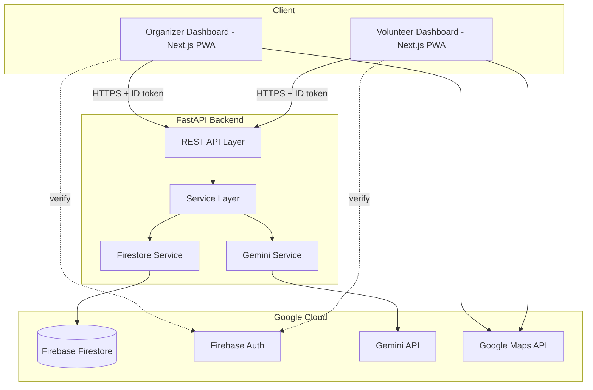
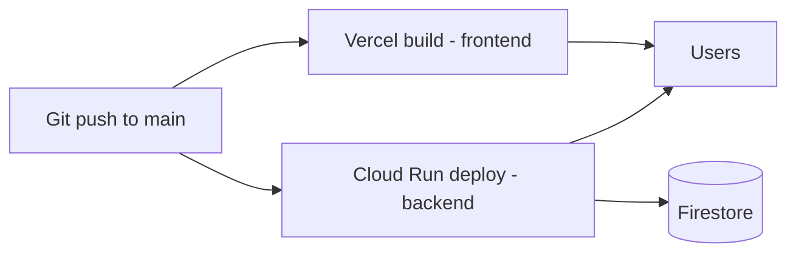

# System Design

## Stadium Operations Dashboard

---

## 1. Overall Architecture

Single Next.js frontend (two role-gated dashboards), one FastAPI backend service, Firestore as the single data store, Gemini as the reasoning layer called synchronously from the backend. No microservices — a hackathon MVP does not need them.



**Why this shape:** one backend service keeps auth, validation, and Gemini prompt construction centralized and testable, instead of calling Gemini directly from the frontend (which would leak the API key and make prompt/output validation impossible to enforce).

---

## 2. Frontend Architecture

- **Framework:** Next.js App Router, TypeScript, TailwindCSS.
- **Routing:** `/organizer/*` and `/volunteer/*` route groups, each behind role-based middleware that checks the Firebase Auth custom claim (`role: organizer | volunteer`).
- **State:** Local component state + a thin data-fetching layer (SWR or React Query) polling/subscribing to Firestore-backed API endpoints. No heavy global state library needed at this scope.
- **Real-time updates:** Firestore's client SDK listeners are used directly on read-only views (e.g., volunteer's own task doc) to get live updates without custom websocket plumbing; writes always go through the FastAPI backend so Gemini/validation logic stays server-side.
- **PWA:** `next-pwa` (or manual manifest + service worker) for installability and offline shell caching. Live data still requires connectivity — offline mode is out of MVP scope.

## 3. Backend Architecture

FastAPI app organized by domain routers:

```
routers/
  data.py         # CSV upload + manual entry endpoints
  analysis.py     # triggers Gemini analysis, returns recommendations
  incidents.py    # incident CRUD + AI summarization
  volunteers.py   # volunteer task assignment + status
  auth.py         # session/role helpers
services/
  gemini_service.py     # all Gemini prompt construction + calls
  firestore_service.py  # all Firestore reads/writes
  validation.py          # input sanitization, schema checks
```

- **Auth:** Firebase Admin SDK verifies the ID token sent from the frontend on every request; role is read from custom claims and enforced per-route.
- **Validation:** Pydantic models validate all incoming CSV/manual data before it's ever included in a Gemini prompt (prevents malformed or oversized input from corrupting AI output).
- **Gemini calls:** always request structured JSON output (see `AI.md`), with a schema-validation + fallback step before the response is written to Firestore or returned to the client.

## 4. Database (Firestore)

Firestore was chosen over Supabase for two hackathon-relevant reasons: native real-time listeners remove the need to build custom polling/websocket code for the volunteer live-task view, and using Firebase end-to-end (Auth + Firestore) directly satisfies the "Google services integration" judging criterion. Full schema in `DATABASE.md`.

## 5. AI Flow

```mermaid
sequenceDiagram
    participant O as Organizer UI
    participant API as FastAPI
    participant G as Gemini API
    participant DB as Firestore

    O->>API: POST /analysis/run (crowd/gate/volunteer data)
    API->>API: validate + build structured prompt
    API->>G: request JSON-schema output
    G-->>API: structured recommendations + reasoning
    API->>API: validate JSON shape; fallback if malformed
    API->>DB: write recommendations
    API-->>O: return recommendations
    DB-->>O: (volunteer clients) live-update via listener
```

Full prompt templates, JSON contracts, and fallback rules are in `AI.md`.

## 6. Authentication

- Firebase Auth (email/password for MVP; org admins pre-provision volunteer accounts).
- Custom claim `role` set via a small admin script or Cloud Function on account creation.
- Frontend middleware + backend token verification both check role — never trust the client alone.

## 7. Deployment

| Component | Platform | Notes |
|---|---|---|
| Frontend (Next.js) | Vercel | Auto-deploy from `main`, environment vars for Firebase/Maps config |
| Backend (FastAPI) | Google Cloud Run | Containerized, scales to zero between demo runs, keeps API key server-side |
| Database/Auth | Firebase | Managed, no separate ops work needed |



---

## 8. Key Trade-offs

| Decision | Chosen | Alternative | Why |
|---|---|---|---|
| DB | Firestore | Supabase (Postgres) | Real-time listeners + tighter Google ecosystem fit for judging criteria; MVP data model doesn't need relational joins |
| Backend framework | FastAPI | Next.js API routes only | Keeps Gemini/validation logic in one typed, testable Python service; easier to unit test AI output handling |
| Real-time strategy | Firestore listeners for reads, REST for writes | Full custom WebSocket layer | Firestore listeners give real-time for free; no custom infra needed for a 10–14 day build |
| Architecture style | Modular monolith (1 backend service) | Microservices per feature | Hackathon MVP scope doesn't justify the operational overhead |
